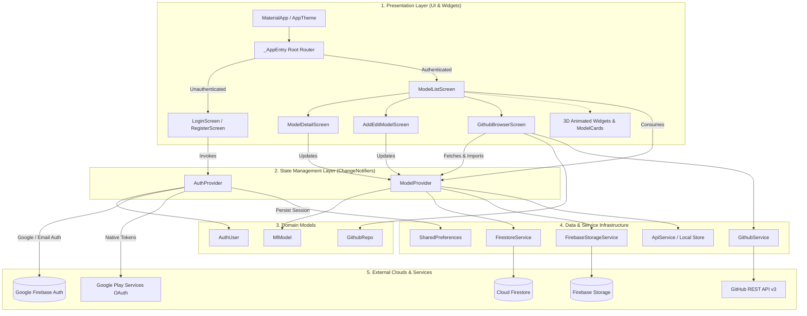
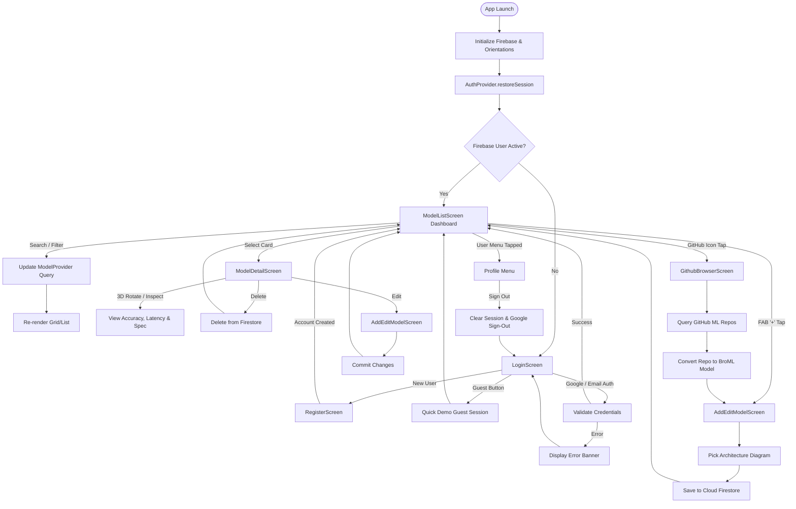
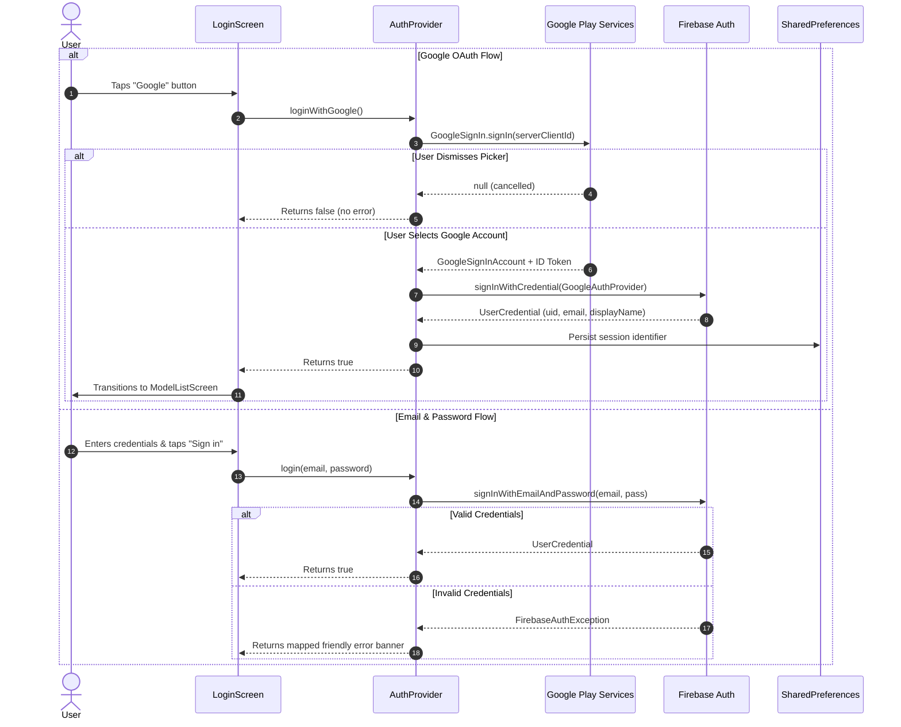
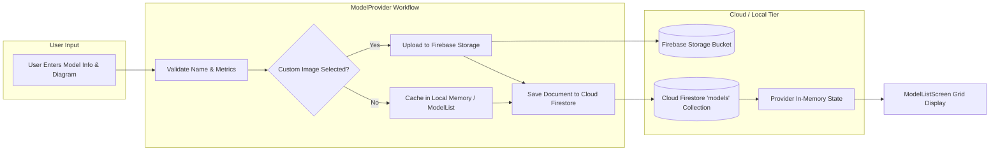

# BroML (AI Model Hub) — System Architecture & Flowchart Specification

---

## 1. Executive Overview

**BroML** (*Neural Architecture Hub & Model Registry*) is a cross-platform Flutter application engineered for machine learning practitioners to register, benchmark, inspect, and explore artificial intelligence models. The system integrates Google Firebase for authentication and cloud persistence, GitHub REST APIs for open-source model repository discovery, and an interactive 3D perspective rendering engine for visual engagement.

---

## 2. High-Level System Architecture

The codebase adheres to a clean, decoupled **Layered Reactive Architecture** powered by the **Provider** pattern:



---

## 3. Application Flowcharts

### 3.1. Master Navigation & Lifecycle Flow



---

### 3.2. Authentication & Authorization Pipeline



---

### 3.3. Model Data Management Flow (CRUD & Cloud Sync)



---

## 4. Codebase Directory Map

```text
meet_app/
├── android/                             # Native Android project configuration
│   ├── app/
│   │   ├── build.gradle.kts             # AGP build rules, signing configs & dependencies
│   │   ├── google-services.json         # Firebase project credentials & OAuth client mappings
│   │   └── src/main/
│   │       ├── AndroidManifest.xml      # App label (BroML), permissions, launcher intent
│   │       └── res/mipmap-*/ic_launcher # 3D Quantum Tensor Cube app icons
│   ├── build.gradle.kts                 # Root project Gradle configuration
│   └── gradle.properties                # JVM heap configuration (-Xmx3072m, G1GC)
├── assets/
│   ├── logo.png                         # High-res BroML 3D Cube identity asset
│   └── logo_small.png                   # Compact navigation bar branding asset
├── lib/
│   ├── main.dart                        # Application entry point, multi-provider wiring, root router
│   ├── models/
│   │   └── ml_model.dart                # Core data entity: MlModel (metrics, latency, framework, dataset)
│   ├── providers/
│   │   ├── auth_provider.dart           # Authentication state, OAuth orchestration, session persistence
│   │   └── model_provider.dart          # Registry state, category filter queries, Firestore sync
│   ├── screens/
│   │   ├── add_edit_model_screen.dart   # Model registration and modification form
│   │   ├── github_browser_screen.dart   # Live GitHub repository search and model importer
│   │   ├── login_screen.dart            # Animated sign-in portal (Google, GitHub, Email, Guest)
│   │   ├── model_detail_screen.dart     # Deep inspection screen with interactive 3D card tilt
│   │   ├── model_list_screen.dart       # Dashboard screen with search bar, category chips, and model grid
│   │   └── register_screen.dart         # Account creation workflow
│   ├── services/
│   │   ├── api_service.dart             # Local model seed catalog & fallback provider
│   │   ├── firebase_storage_service.dart# Image picker & Firebase Storage asset uploader
│   │   ├── firestore_service.dart       # Cloud Firestore NoSQL repository operations
│   │   └── github_service.dart          # GitHub REST API v3 client for machine learning repositories
│   ├── theme/
│   │   └── app_theme.dart               # Dark/Light design system, neon cyan/indigo tokens, typography
│   └── widgets/
│       ├── animated_3d_card.dart        # Gyro/touch 3D perspective rotation matrix widget
│       ├── auth_shell.dart              # Glassmorphism container with backdrop filter glow
│       ├── common_widgets.dart          # Skeleton loaders, ErrorBanners, ButtonSpinner, EmptyState
│       ├── flip_3d_card.dart            # Dual-sided animated card flip on user tap
│       ├── floating_3d_badge.dart       # Elevated floating pill badge with drop shadows
│       ├── model_card.dart              # Interactive model card with performance indicators
│       └── model_image.dart             # Cached image renderer with network placeholder fallbacks
├── test/
│   ├── auth_provider_test.dart          # Automated unit test suite (validation, session, auth rules)
│   └── widget_test.dart                 # Component integration test (login -> model hub -> logout)
├── web/                                 # Web platform assets, manifest.json & index.html
└── pubspec.yaml                         # Dependencies (firebase_auth, firestore, google_sign_in, etc.)
```

---

## 5. Architectural Quality Matrix

| Architectural Dimension | Implementation Strategy | Verification Metric |
| :--- | :--- | :--- |
| **Separation of Concerns** | Decoupled UI (screens/widgets), Logic (providers), and Services | `flutter analyze`: **0 issues** |
| **Authentication Integrity** | Real Firebase Auth + OAuth 2.0 Web Client validation | Zero mock user fallbacks; real session restore |
| **Persistence & Fallbacks** | Cloud Firestore with offline cache fallback | Seamless loading even on degraded networks |
| **Responsiveness & UX** | 3D matrix transformations, curved animations, skeleton loading | Fluid 60 FPS transitions across form factors |
| **Build Stability** | JVM memory tuned (`-Xmx3072m`), R8 optimization rules tailored | Debug and Release APKs compile with exit code 0 |
