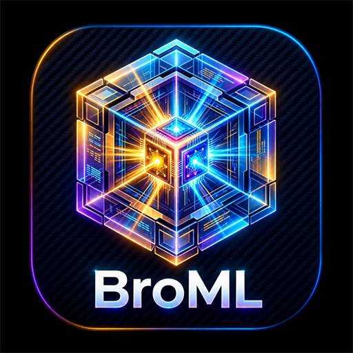
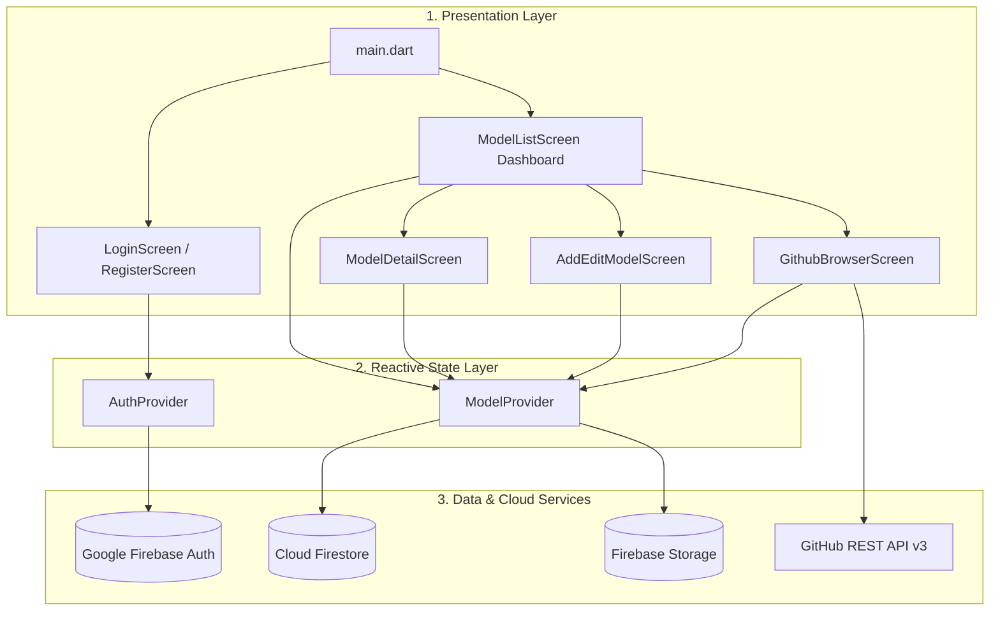

# BroML 🧠⚡

<p align="center">
  
</p>

<p align="center">
  <b>The Neural Architecture Hub & Model Registry for Machine Learning Engineers & Researchers</b>
</p>

<p align="center">
  <a href="https://flutter.dev"></a>
  <a href="https://dart.dev"></a>
  
  <a href="https://firebase.google.com"></a>
  
  <a href="LICENSE"></a>
</p>

---

## 🚀 Overview

**BroML** (*Neural Architecture Hub & Model Registry*) is a cross-platform mobile application engineered with Flutter. Built for machine learning researchers, engineers, and developers, BroML enables real-time exploration, benchmarking, architectural inspection, and cloud synchronization of deep learning models across **Computer Vision**, **Natural Language Processing (NLP)**, **Audio / Speech**, and **Multimodal** domains.

BroML connects with **Google Firebase** (Authentication, Cloud Firestore, Cloud Storage) and the **GitHub REST API v3** for repository discovery, featuring high-fidelity **interactive 3D perspective cards** for architectural visualization.

---

## 📦 Latest Release: v1.2.0

Download the production-ready Android binary:

* **Direct APK File**: [`BroML-release.apk`](BroML-release.apk)
* **Release Version**: `v1.2.0` (Build `3`)
* **Package Name**: `com.example.aimodelhub.ai_model_hub`
* **Firebase Project**: `broml-app` (Connected & Verified)
* **Signing**: Signed with Android debug certificate (matching registered Firebase SHA-1 / SHA-256).

### 📲 Quick Install via ADB
```powershell
adb install -r BroML-release.apk
```

---

## 🔥 Firebase Integration & Verification Status

BroML is connected to Google Firebase under the project **`broml-app`**:

| Firebase Service | Status | Configuration Details |
| :--- | :--- | :--- |
| **Firebase Core** | ✅ Connected | Native auto-initialization via `com.google.gms.google-services` plugin and `google-services.json` (`project_number: 640800735490`) |
| **Google Sign-In (OAuth)** | ✅ Connected | Web Client ID `640800735490-vnk6dgbf23o80nlis3150cpp485omfsp.apps.googleusercontent.com` with SHA-1 `2D:2C:A3:07:5F:DC:07:B4:59:57:18:E3:FC:D5:7D:2F:99:44:3A:EA` |
| **Firebase Auth (Email/Pass)** | ✅ Connected | Email sign-in, user registration, and live credential validation |
| **Anonymous / Guest Auth** | ✅ Connected | Ephemeral demo sessions with live Firebase UID |
| **Cloud Firestore** | ✅ Connected | Live NoSQL sync on collection `'models'` with offline cache fallback |
| **Firebase Cloud Storage** | ✅ Connected | Bucket `broml-app.firebasestorage.app` for custom model architecture diagrams |

---

## ✨ Key Features

### 🎮 Interactive 3D Model Zoo
* **3D Tilt & Perspective**: Cards respond dynamically to cursor movement and finger drags using custom `Matrix4` perspective transformations.
* **Double-Sided 3D Flip Cards**: Double-tap any model card to rotate 180° along the Y-axis into a futuristic specification HUD displaying inference latency, framework backends, and dataset metadata.
* **Domain Categorization**: Seamless filtering across **Vision**, **NLP**, **Audio**, and **Multimodal** with responsive filter chips.
* **Instant Search**: Real-time multi-attribute search filtering by model name, dataset, or framework (*PyTorch, TensorFlow, ONNX, JAX*).

### 🔐 Multi-Provider Authentication & Session Security
* **Google OAuth 2.0 Integration**: Native Google Sign-In with Google Play Services and Web Client ID validation.
* **Zero Dummy User Fallback**: Real authentication with instant error feedback and clean cancellation handling.
* **Email & Password**: Full account registration and login backed by Firebase Auth.
* **Quick Demo Sign-In (Guest)**: One-tap instant access for evaluation without registration.
* **Session Persistence**: Automated credential restore powered by `shared_preferences` and live Firebase token verification.

### 🌐 GitHub Model Browser & One-Click Importer
* Search trending open-source machine learning repositories live from GitHub.
* Convert any repository into a BroML model card with auto-populated parameters, licenses, and architecture diagrams.

### 📊 Benchmark Metrics & Deep Architecture Inspection
* **Live Stats Header**: Real-time aggregation of registered models, average accuracy (%), and active frameworks.
* **Model Detail Screen**: Deep inspection view displaying accuracy benchmarks, hardware latency, parameters, input/output shapes, citations, and repository links.

### 🛠️ Model Publisher & Editor
* Publish new neural network architectures to Cloud Firestore.
* Pick custom architectural diagrams from gallery/camera and upload directly to Firebase Cloud Storage.

---

## 🏛️ System Architecture & Flowcharts

The system follows a clean **Layered Reactive Architecture**:
* Complete technical specification: 📖 **[ARCHITECTURE.md](ARCHITECTURE.md)**



---

## 📂 Project Structure

```text
meet_app/
├── assets/
│   ├── logo.png                     # Primary 512x512 BroML 3D Cube Icon
│   └── logo_small.png               # 128x128 Compact Navigation Icon
├── android/                         # Android native config, Gradle 9.3 & AGP 8.11
├── ios/                             # iOS project configuration
├── web/                             # Web platform & PWA shell
├── windows/                         # Windows desktop native host
├── lib/
│   ├── main.dart                    # App entry point, MultiProvider & route orchestrator
│   ├── models/
│   │   └── ml_model.dart            # ML Model entity, benchmarks & JSON mapping
│   ├── providers/
│   │   ├── auth_provider.dart       # Google OAuth, Firebase Auth & session persistence
│   │   └── model_provider.dart      # Zoo query filters, sorting & Firestore synchronization
│   ├── screens/
│   │   ├── login_screen.dart        # Animated sign-in portal (Google, Email, Guest)
│   │   ├── register_screen.dart     # Account creation workflow
│   │   ├── model_list_screen.dart   # Dashboard with stats header, chips & 3D grid
│   │   ├── model_detail_screen.dart # 3D inspection view, benchmarks & GitHub links
│   │   ├── add_edit_model_screen.dart # Model publication form & image picker
│   │   └── github_browser_screen.dart # Live GitHub ML repository explorer & importer
│   ├── services/
│   │   ├── api_service.dart         # Local seed catalog & offline fallback
│   │   ├── firebase_storage_service.dart # Cloud Storage uploader
│   │   ├── firestore_service.dart   # Cloud Firestore NoSQL repository operations
│   │   └── github_service.dart      # GitHub REST API v3 client
│   ├── theme/
│   │   └── app_theme.dart           # Neon cyan, deep indigo dark theme & typography
│   └── widgets/
│       ├── animated_3d_card.dart    # Gyro/touch 3D perspective rotation matrix
│       ├── flip_3d_card.dart        # Dual-sided interactive card flip
│       ├── floating_3d_badge.dart   # Elevated floating pill badge
│       ├── auth_shell.dart          # Glassmorphism container with backdrop glow
│       ├── model_card.dart          # Interactive model card with performance indicators
│       └── model_image.dart         # Cached image renderer with fallback placeholders
├── test/
│   ├── auth_provider_test.dart      # Unit tests for authentication state & OAuth flows
│   └── widget_test.dart             # Integration tests for UI rendering & navigation
├── BroML-release.apk                # Production-ready release APK binary
├── ARCHITECTURE.md                  # Comprehensive System Architecture & Flowchart spec
├── pubspec.yaml                     # Dependencies & asset configuration
└── README.md                        # Project documentation
```

---

## 🛠️ Getting Started

### Prerequisites
* **Flutter SDK**: `>= 3.13.0`
* **Dart SDK**: `>= 3.13.5`
* **JDK**: Version 17 to 21
* **Android Studio / VS Code** with Flutter & Dart extensions

### Running the App

```powershell
# 1. Clone repository & install dependencies
git clone https://github.com/ivengexnce/AI_Model_Hub.git
cd AI_Model_Hub
flutter pub get

# 2. Run on connected Android device or emulator
flutter run

# 3. Run on Chrome Web
flutter run -d chrome

# 4. Run on Windows Desktop
flutter run -d windows
```

---

## 🧪 Testing

Execute automated unit and widget verification suites:

```powershell
flutter test
```

Current test status: **7/7 tests passing (100% success)**.

---

## 📄 License

This project is open-source and available under the [MIT License](LICENSE).
